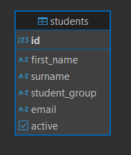

# Система управления студентами

## Эндпоиныт

-   GET `/students` - получить список всех студентов
-   GET `/students/active` - получить только активных студентов
-   GET `/students/{id}` - получить информацию о студенте по ID
-   POST `/students` - добавить нового студента
-   DELETE `/students/{id}` - удалить студента

## Модель данных

## Инструкция по развертыванию:

### Требуемое ПО:

-   Docker

### Шаги:

1. В папке проекта запускаем docker-compose.yaml командой `docker-compose up`, настройки можно отредактировать в .env файле.
1. После завершения загрузки API доступно по порту, указанному в .env файле: `localhost:$BACK_PORT/api`.
1. В проекте присутствует контейнер tests, на котором запускаются тесты, в логахи пишется статус тестов.
1. В проекте присутствует Swagger, поэтому доступные API можно найти по URL: `localhost:$BACK_PORT/docs`.

## Инструкция по тестированию

### Требуемое ПО:

-   Python

### Шаги:

1. Предварительно запускаем backend и ожидаем его запуска.
1. `cd tests`
1. `python -m venv venv`
1. `source venv/bin/activate` (Linux/macOS), `.\venv\Scripts\activate` (Windows)
1. `pip install pytest requests allure-pytest`
1. В файле api_tests.py указыавем при изменении данных хоста бэкенда URL и Порт рядом с os.getenv('BACK_PORT', '<требуемый url>'), os.getenv('BACK_PORT', <требуемый порт>).
1. `pytest -v api_tests.py`, в консоли отображается статус тестов
